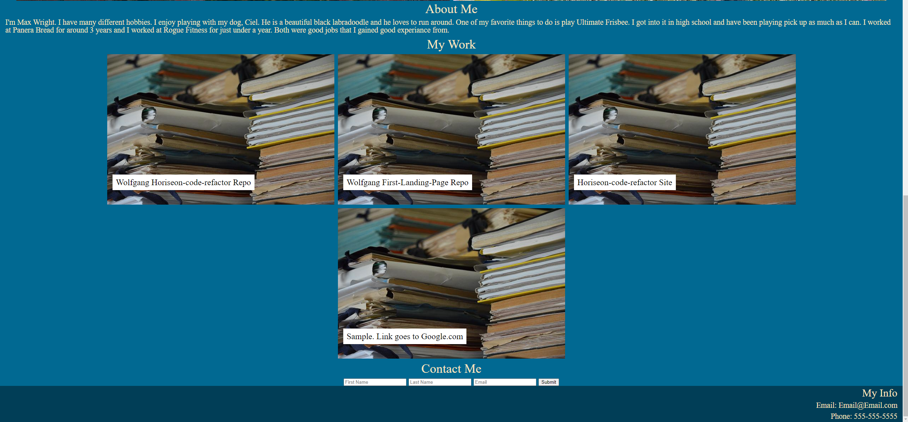

  # React Portfolio

1. [Description](#Description)
2. [Install Instructions](#Install-Instructions)
3. [How to use this app](#How-to-use-this-app)
4. [License](#License)
5. [Credits](#Credits)
6. [Tests](#Tests)
7. [Github](#Github)
8. [Contact Me](#Contact-Me)

  
          
  
  
  ## Description 
  This is a portfolio created with react
  
  ## Install Instructions
  No installation is necessary.
  
  ## How to use this app
  The app is all front end it is just a web page created with react.        
  
  ## Credits
  This application was made by Maximillian

  ## Tests
  No testing.

  ## Github 
 Here is the link to my github account [Wolfgang978](https://github.com/Wolfgang978)
  
  
  ## Contact Me
  If you have any further questions about the application you can reach me at 18wrightm@gmail.com

  ## Screenshot
  
  

  ## Link to project
  [Deployed Application](https://mighty-headland-77146.herokuapp.com/)

 
